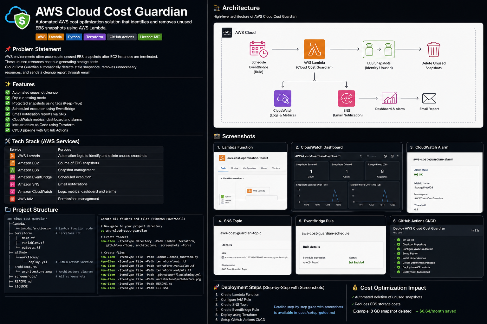

# AWS Cloud Cost Guardian 🚀

> **Automated AWS Cost Optimization using AWS Lambda, EventBridge, CloudWatch, SNS, Terraform, and GitHub Actions.**



---

# 📖 Overview

AWS Cloud Cost Guardian is a serverless automation project that helps reduce unnecessary AWS storage costs by identifying and deleting unused EBS snapshots.

The solution runs automatically on a schedule, publishes CloudWatch metrics, sends email reports using SNS, and is deployed through a GitHub Actions CI/CD pipeline. Infrastructure is managed with Terraform.

---

# ✨ Features

- Automated EBS snapshot cleanup
- Dry Run mode
- Keep=True tag protection
- CloudWatch Metrics & Dashboard
- CloudWatch Alarms
- SNS Email Notifications
- EventBridge Scheduling
- Terraform Infrastructure as Code
- GitHub Actions CI/CD

---

# 🏗 Architecture

```text
GitHub
   │
GitHub Actions
   │
AWS Lambda
   │
EC2 / EBS
   ├── Delete Unused Snapshots
   ├── CloudWatch Metrics
   └── SNS Email
```

---

# ☁ AWS Services

| Service | Purpose |
|----------|---------|
| Lambda | Automation |
| EC2 | Volume discovery |
| EBS | Snapshot cleanup |
| EventBridge | Scheduling |
| SNS | Email |
| CloudWatch | Monitoring |
| IAM | Permissions |
| Terraform | IaC |
| GitHub Actions | CI/CD |

---

# 📂 Project Structure

```text
aws-cloud-cost-guardian/
├── .github/workflows/deploy.yml
├── architecture/
├── docs/
├── lambda/
├── screenshots/
├── terraform/
└── README.md
```

---

# 🚀 Deployment Steps

1. Create IAM Role & Policy
2. Create Lambda Function
3. Configure SNS Topic
4. Configure EventBridge Schedule
5. Configure CloudWatch Dashboard
6. Configure CloudWatch Alarm
7. Validate Terraform
8. Push to GitHub
9. GitHub Actions deploys Lambda automatically

---

# 📸 Screenshots

Replace the placeholders below with your screenshots.

- Lambda Function
- IAM Role
- SNS Topic
- EventBridge Scheduler
- CloudWatch Dashboard
- CloudWatch Alarm
- GitHub Actions Success

---

# 🔄 CI/CD

```text
Developer
   │
Git Push
   │
GitHub Actions
   │
Package Lambda
   │
Deploy Lambda
```

---

# 🧪 Testing

- Lambda Test Event
- EventBridge Trigger
- CloudWatch Metrics
- SNS Email
- GitHub Actions Deployment

---

# 📈 Future Improvements

- Multi-region support
- Slack notifications
- AWS Cost Explorer integration
- AWS Organizations support

---

# 👨‍💻 Author

**Revanth B**

GitHub: https://github.com/revanth-bl
